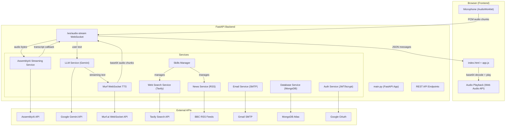
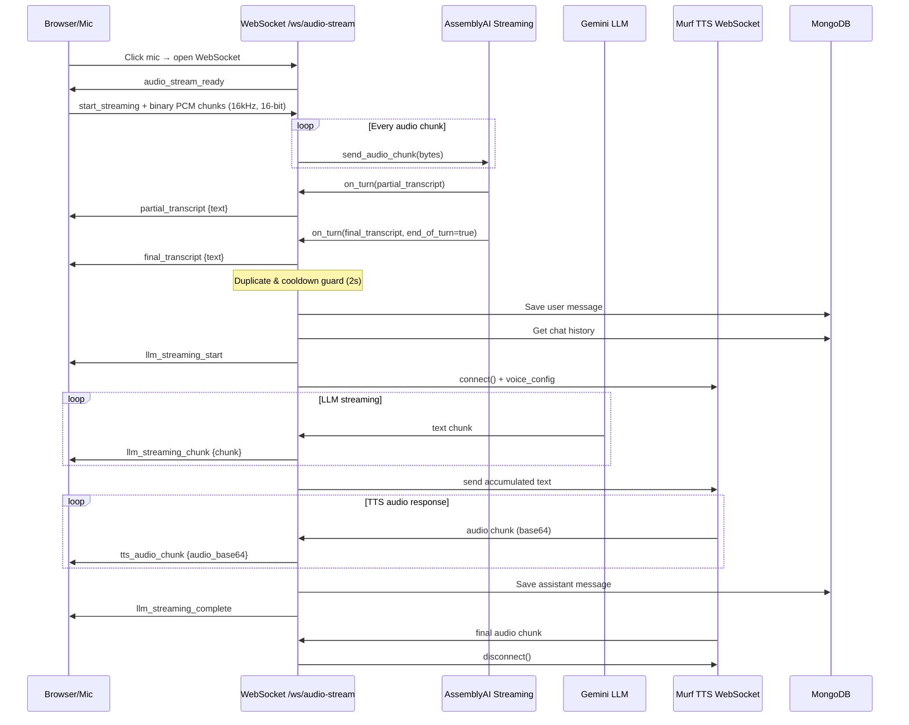
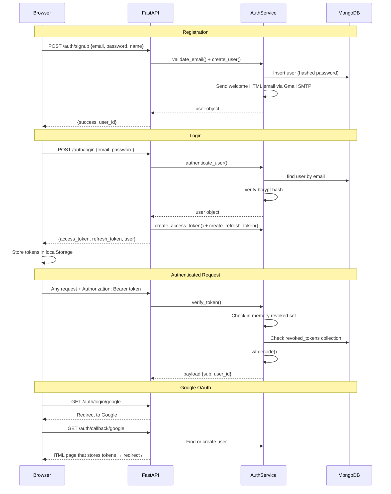

# TalkEasy Voice Assistant — Full Codebase Walkthrough

## Overview

**TalkEasy** is an AI-powered **real-time voice assistant** web application. Users speak into their microphone, the audio is streamed to the server for live transcription, the transcribed text is sent to an LLM for a response, and the LLM response is converted to speech and streamed back — all in real-time via WebSockets.

| Layer | Technology |
|---|---|
| **Backend** | Python / FastAPI + Uvicorn |
| **Frontend** | Vanilla HTML/CSS/JS (Jinja2 templates) |
| **Database** | MongoDB Atlas (via Motor async driver) |
| **STT** | AssemblyAI (streaming + batch) |
| **LLM** | Google Gemini 2.5 Flash |
| **TTS** | Murf.ai (WebSocket streaming) |
| **Web Search** | Tavily API |
| **News** | BBC RSS feeds via feedparser |
| **Auth** | JWT + bcrypt + Google OAuth (Authlib) |
| **Deployment** | Render.com |

---

## Architecture Diagram



---

## Core Data Flow (Voice Conversation)

The primary workflow is a **real-time bidirectional voice conversation** over a single WebSocket connection:



---

## File-by-File Breakdown

### Backend Core

---

#### [main.py](file:///d:/Web_Development/Projects/TalkEasy-voiceAssistant/main.py) (1348 lines)

The **monolithic entry point** that contains the FastAPI app, all route handlers, and the WebSocket streaming orchestrator.

**Key responsibilities:**
- **Lifespan management** (lines 51–82): Connects DB on startup, cleans up on shutdown
- **Service initialization** (lines 103–202): Defensively initializes all 6 services from env vars
- **OAuth setup** (lines 206–230): Registers Google OAuth via Authlib
- **REST endpoints:**
  - `GET /` — serves `index.html` with a session ID
  - `GET /agent/chat/{session_id}/history` — fetch chat history
  - `GET /agent/chat/all` — all histories (filtered by user if auth header present)
  - `DELETE /agent/chat/{session_id}/history` — delete a session
  - `POST /api/config` — hot-reload API keys
  - `POST /api/persona/switch` — change AI persona
  - `POST /api/web-search` — manual web search
  - `POST /agent/chat/{session_id}` — batch voice chat (upload audio → transcribe → LLM → TTS → response)
- **Auth endpoints:**
  - `POST /auth/signup` — register, send welcome email, schedule deliverability check
  - `POST /auth/login` — authenticate, issue JWT access + refresh tokens
  - `GET /auth/login` & `GET /auth/register` — serve HTML pages
  - `POST /auth/logout` — revoke token (in-memory + DB)
  - `GET /auth/login/google` — start Google OAuth flow
  - `GET /auth/callback/google` — handle OAuth callback, create user if new
- **WebSocket handler** (`/ws/audio-stream`, lines 1125–1341): The heart of real-time streaming
- **`handle_llm_streaming()`** (lines 944–1122): Orchestrates LLM → Murf TTS pipeline with session locking

**Key patterns:**
- Uses `session_locks` (Dict of asyncio.Lock) to prevent concurrent LLM calls for the same session
- 2-second cooldown between transcript processing to prevent duplicate LLM calls
- Normalizes transcript text before comparing to prevent re-processing

---

### Services Layer

---

#### [llm_service.py](file:///d:/Web_Development/Projects/TalkEasy-voiceAssistant/services/llm_service.py) (351 lines)

Wraps **Google Gemini 2.5 Flash** with persona support and auto-language detection.

| Method | Purpose |
|---|---|
| `set_persona(persona)` | Switches between 5 personas (default, pirate, developer, cowboy, robot) |
| `_detect_language(text)` | Detects Hindi (Devanagari chars) vs English |
| `_should_perform_web_search(text)` | Keyword-based trigger for auto web search |
| `generate_response(text, history)` | Batch response with auto web search + news detection |
| `generate_streaming_response(text, history)` | AsyncGenerator for streaming — used by WebSocket path |

**Logic flow in `generate_response()`:**
1. Detect language → build language instruction
2. Check for web search triggers → if yes, search via Tavily → feed results into an enhanced LLM prompt
3. Check for news keywords → if yes, fetch via BBC RSS → return formatted headlines
4. Otherwise, normal Gemini prompt with chat history context

---

#### [assemblyai_streaming_service.py](file:///d:/Web_Development/Projects/TalkEasy-voiceAssistant/services/assemblyai_streaming_service.py) (248 lines)

Manages the **AssemblyAI Universal Streaming v3** client for real-time speech-to-text.

**Key design:**
- Runs AssemblyAI's synchronous event callbacks (`on_begin`, `on_turn`, `on_terminated`, `on_error`) and bridges them to the async FastAPI world via `asyncio.run_coroutine_threadsafe()`
- Streaming params: 16kHz, PCM s16le, formatted turns, end-of-turn confidence threshold 0.5, min silence 1200ms
- `send_audio_chunk(bytes)` — forwards raw PCM to AssemblyAI's `client.stream()`
- Throttles "not ready" warnings to every 5 seconds to prevent log spam

---

#### [murf_websocket_service.py](file:///d:/Web_Development/Projects/TalkEasy-voiceAssistant/services/murf_websocket_service.py) (260 lines)

Manages the **Murf.ai WebSocket** connection for text-to-speech audio streaming.

**Key design:**
- Connects to `wss://api.murf.ai/v1/speech/stream-input` with API key + 44.1kHz WAV config
- Uses a **static context ID** to avoid "Exceeded Active context limit" errors
- `stream_text_to_audio(text_stream)`: Collects all LLM text chunks first, then sends as one message to Murf for better audio quality
- `_listen_for_audio()`: Yields base64-encoded audio chunks with `is_final` flag
- `clear_context()`: Sends clear command on each new connection to prevent stale context issues
- Uses `asyncio.Lock` (`_recv_lock`) to prevent concurrent `recv()` calls

---

#### [database_service.py](file:///d:/Web_Development/Projects/TalkEasy-voiceAssistant/services/database_service.py) (520 lines)

Async MongoDB driver (Motor) with **in-memory fallback** for when DB is unavailable.

**Collections:**
- `chat_sessions` — indexed on `session_id` (unique) and `last_activity`
- `users` — indexed on `email` (unique)
- `revoked_tokens` — indexed on `token` (unique) + TTL index on `expires_at`
- `system_info` — initialization marker

**Key methods:**
- `add_message_to_history()` — upserts into chat_sessions with user_id attribution
- `get_all_chat_histories()` — returns all sessions, latest first
- `add_revoked_token()` / `is_token_revoked()` — token revocation with TTL
- Every method has an in-memory fallback path (`self.in_memory_store`)

---

#### [auth_service.py](file:///d:/Web_Development/Projects/TalkEasy-voiceAssistant/services/auth_service.py) (774 lines)

Comprehensive authentication service.

**Capabilities:**
- Password hashing via `passlib` bcrypt
- Email validation with typo detection (gmail.com typos, disposable domain rejection)
- Email deliverability checking via SMTP/MX probes with caching
- JWT creation/verification (access tokens: 60 min, refresh tokens: 30 days)
- Token revocation (in-memory set + DB persistence)
- User CRUD with DB-first + in-memory fallback
- Welcome email sending via Gmail SMTP with beautiful HTML template

> [!WARNING]
> **Hardcoded SMTP credentials** are present at lines 514–516 (`talkeasyofficial100@gmail.com` + app password). These should be moved to environment variables.

---

#### [custom_web_search_service.py](file:///d:/Web_Development/Projects/TalkEasy-voiceAssistant/services/custom_web_search_service.py) (119 lines)

Tavily API client with 5-minute result caching.

---

#### [news_service.py](file:///d:/Web_Development/Projects/TalkEasy-voiceAssistant/services/news_service.py) (87 lines)

Fetches news via BBC RSS feeds (7 categories: general, technology, business, sports, entertainment, health, science).

---

#### [skills_manager.py](file:///d:/Web_Development/Projects/TalkEasy-voiceAssistant/services/skills_manager.py) (34 lines)

Simple registry that holds `news` and `web_search` services as named skills.

---

#### [email_service.py](file:///d:/Web_Development/Projects/TalkEasy-voiceAssistant/services/email_service.py) (55 lines)

Generic SMTP email sender using env vars (`SMTP_HOST`, `SMTP_USER`, etc.). Currently not configured in `.env`.

---

#### [stt_service.py](file:///d:/Web_Development/Projects/TalkEasy-voiceAssistant/services/stt_service.py) (45 lines)

Batch transcription via AssemblyAI (used by the `POST /agent/chat/{session_id}` REST endpoint, not the streaming path).

---

#### [tts_service.py](file:///d:/Web_Development/Projects/TalkEasy-voiceAssistant/services/tts_service.py) (62 lines)

Batch TTS via Murf REST API (used by the REST chat endpoint). Truncates text to 3000 chars at sentence boundaries.

---

### Models

#### [schemas.py](file:///d:/Web_Development/Projects/TalkEasy-voiceAssistant/models/schemas.py) (119 lines)

Pydantic models for API request/response validation:
- `ErrorType` enum (8 error types)
- `VoiceChatResponse`, `ChatHistoryResponse`, `BackendStatusResponse`
- `WebSearchResult`, `WebSearchResponse`
- `APIKeyConfig` with key validation

---

### Frontend

---

#### [index.html](file:///d:/Web_Development/Projects/TalkEasy-voiceAssistant/templates/index.html) (331 lines)

Main app page with:
- **Sidebar**: New Chat, Show Logs, Show History, Clear History, Web Search toggle, Murf branding
- **Header**: Connection status, persona selector (5 personas), login/account dropdown
- **Chat area**: Scrollable message history + mic button
- **Conversation History Popup**: Draggable popup showing all past sessions
- Loads `marked.js` for Markdown, `highlight.js` for code syntax, Font Awesome for icons
- Extension protection script (blocks injection from browser extensions)

---

#### [app.js](file:///d:/Web_Development/Projects/TalkEasy-voiceAssistant/static/app.js) (1559 lines)

The main frontend controller handling:

1. **Session management**: Generates/reads session IDs from URL params
2. **WebSocket lifecycle**: 
   - Opens `/ws/audio-stream?session_id=...&token=...`
   - Handles 12+ message types (transcripts, LLM chunks, TTS audio, errors)
3. **Audio capture**: Uses `AudioWorkletNode` (with `ScriptProcessorNode` fallback) to capture mic at 16kHz mono, converts to Int16 PCM, sends as binary WebSocket frames
4. **Audio playback**: Decodes base64 WAV chunks → Float32 PCM → Web Audio API buffer source scheduling with `playheadTime` for gapless playback
5. **Chat UI**: Renders messages with Markdown parsing, streaming text updates via `requestAnimationFrame`, dots-loader placeholder during AI thinking
6. **Conversation history**: Loads from server for logged-in users, from `sessionStorage` for anonymous users
7. **Web search toggle**: Sends toggle state via WebSocket JSON command
8. **Persona switching**: POST to `/api/persona/switch`
9. **Config modal**: Save/load API keys to `localStorage` and POST to server
10. **`startCaptureAndStream()`** (lines 1462–1559): Alternative VAD-based capture function (energy threshold)

---

#### [audio-processor.js](file:///d:/Web_Development/Projects/TalkEasy-voiceAssistant/static/audio-processor.js) (37 lines)

AudioWorklet processor that buffers 4096 samples (~256ms at 16kHz) of Float32 → Int16 PCM conversion, then posts to main thread.

---

#### [auth.js](file:///d:/Web_Development/Projects/TalkEasy-voiceAssistant/static/auth.js) (237 lines)

Auth UI controller:
- Auto-redirects logged-in users away from login/register pages
- Handles login form → `POST /auth/login` → stores tokens in `localStorage`
- Handles register form → `POST /auth/signup` → redirects to login
- Central `doLogout()` function with `keepalive` fetch + `sendBeacon` fallback
- Manages header auth dropdown (Account pill → menu with Logout)

---

#### Auth Pages

- [login.html](file:///d:/Web_Development/Projects/TalkEasy-voiceAssistant/templates/auth/login.html): Split layout with animated hero + login form + Google/Apple OAuth buttons
- [register.html](file:///d:/Web_Development/Projects/TalkEasy-voiceAssistant/templates/auth/register.html): Similar layout with registration form

---

### Utilities

#### [constants.py](file:///d:/Web_Development/Projects/TalkEasy-voiceAssistant/utils/constants.py) — Error-type-to-user-message mapping
#### [logging_config.py](file:///d:/Web_Development/Projects/TalkEasy-voiceAssistant/utils/logging_config.py) — Console (INFO) + file (ERROR) logging with UTF-8 support
#### [json_utils.py](file:///d:/Web_Development/Projects/TalkEasy-voiceAssistant/utils/json_utils.py) — `DateTimeEncoder` for JSON serialization of datetime objects

---

## Authentication Flow



---

## Observations & Potential Issues

> [!WARNING]
> ### Security Concerns
> - **API keys in `.env` are committed to git** — the `.env` file contains real API keys (Gemini, AssemblyAI, Murf, MongoDB Atlas) and should be in `.gitignore`
> - **Hardcoded SMTP credentials** in [auth_service.py:514-516](file:///d:/Web_Development/Projects/TalkEasy-voiceAssistant/services/auth_service.py#L514-L516) — Gmail app password is embedded in source code
> - **JWT secret** (`SECRET_KEY` in `.env`) is a static dev key — should be a strong random value in production
> - **No CORS middleware** configured — may need `CORSMiddleware` for cross-origin deployments

> [!NOTE]
> ### Architecture Observations
> - **Monolithic `main.py`** (1348 lines) handles routes, WebSocket, auth, and orchestration — could be split into routers
> - **Two STT services**: `STTService` (batch) and `AssemblyAIStreamingService` (real-time) exist side by side
> - **Two TTS services**: `TTSService` (REST) and `MurfWebSocketService` (streaming) — only the WebSocket one is used in the streaming path
> - **In-memory fallback everywhere** — the system gracefully degrades when MongoDB is unavailable
> - **Session locks** prevent concurrent LLM calls per session, but locks are cleaned up immediately after use — not persisted across reconnects
> - The `startCaptureAndStream()` function in `app.js` (lines 1462–1559) appears to be an alternative/experimental VAD-based audio capture that is **not currently wired to any UI element**

> [!TIP]
> ### Useful Entry Points
> - **To modify AI behavior**: Edit persona prompts in [llm_service.py:21-27](file:///d:/Web_Development/Projects/TalkEasy-voiceAssistant/services/llm_service.py#L21-L27)
> - **To add new skills**: Register in [skills_manager.py](file:///d:/Web_Development/Projects/TalkEasy-voiceAssistant/services/skills_manager.py) and handle in `llm_service.py`
> - **To change the voice**: Set `MURF_VOICE_ID` env var (currently `en-IN-aarav`)
> - **To change the LLM model**: Edit the default in [llm_service.py:11](file:///d:/Web_Development/Projects/TalkEasy-voiceAssistant/services/llm_service.py#L11) (currently `gemini-2.5-flash`)
> - **To add new WebSocket message types**: Handle in `audioStreamSocket.onmessage` in [app.js:616-687](file:///d:/Web_Development/Projects/TalkEasy-voiceAssistant/static/app.js#L616-L687)

---

## Project Structure Summary

```
TalkEasy-voiceAssistant/
├── main.py                          # FastAPI app, all routes, WebSocket handler
├── .env                             # API keys and config
├── requirements.txt                 # Python dependencies (28 packages)
├── render.yaml                      # Render.com deployment config
├── package.json                     # Minimal Node (only mongodb client)
│
├── models/
│   ├── schemas.py                   # Pydantic models
│   └── auth_schemas.py              # Stub (auth models removed)
│
├── services/
│   ├── llm_service.py               # Google Gemini LLM wrapper
│   ├── stt_service.py               # AssemblyAI batch transcription
│   ├── tts_service.py               # Murf REST TTS
│   ├── assemblyai_streaming_service.py  # AssemblyAI real-time streaming STT
│   ├── murf_websocket_service.py    # Murf WebSocket streaming TTS
│   ├── database_service.py          # MongoDB + in-memory fallback
│   ├── auth_service.py              # JWT auth, email validation, user mgmt
│   ├── email_service.py             # Generic SMTP email sender
│   ├── custom_web_search_service.py # Tavily web search
│   ├── news_service.py              # BBC RSS news
│   └── skills_manager.py            # Skill registry
│
├── static/
│   ├── app.js                       # Main frontend controller (1559 lines)
│   ├── auth.js                      # Auth UI handler
│   ├── audio-processor.js           # AudioWorklet for mic capture
│   ├── style.css                    # Main styles
│   ├── auth.css                     # Auth page styles
│   ├── logo.png / image.png         # Brand assets
│   └── favicon.ico
│
├── templates/
│   ├── index.html                   # Main app page
│   ├── login.html                   # (redirect/stub)
│   └── auth/
│       ├── login.html               # Login page
│       └── register.html            # Registration page
│
├── utils/
│   ├── constants.py                 # Error fallback messages
│   ├── logging_config.py            # Logging setup
│   └── json_utils.py                # DateTime JSON encoder
│
├── streamed_audio/                  # Saved audio recordings (46 WAV files)
├── setup_google_oauth.ps1/.sh       # OAuth setup scripts
└── test_user_creation.py            # Test script
```
